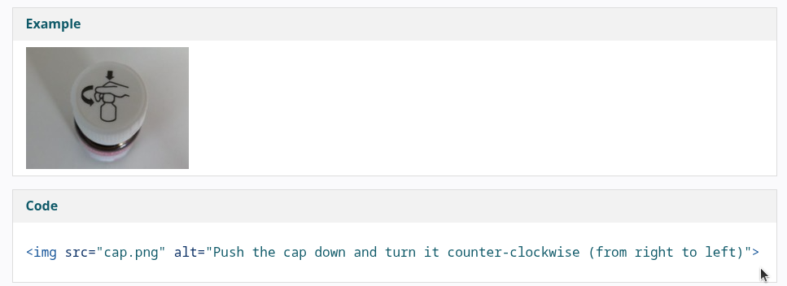
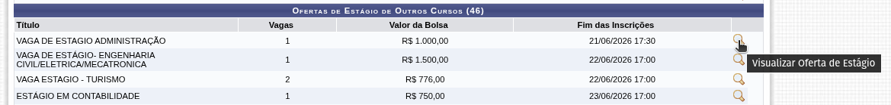
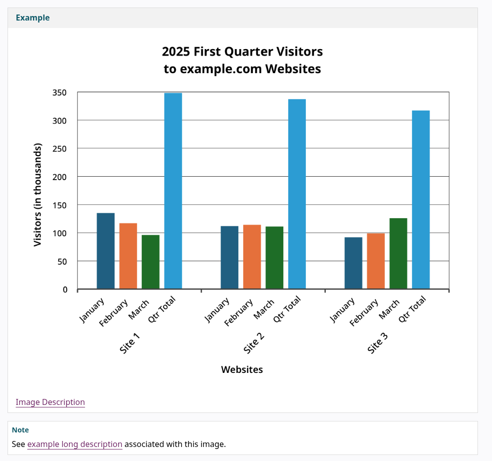
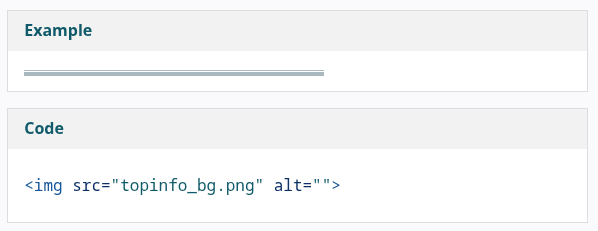

import SimpleChecklist from "@site/src/components/SimpleChecklist";

# 📝 Geração de Conteúdo

Análise dos critérios de acessibilidade relacionados a conteúdo. Esta seção documenta como validar se textos, imagens, vídeos e áudio do site atendem aos requisitos da WCAG, NBR 17225 e diretrizes.

---

## Textos

Conteúdo em texto é essencial para apresentar informações na web. Textos escritos, estruturados
e marcados de forma acessível, e que permitem a formatação mais adequada para cada usuário,
são mais fáceis de ler e de serem compreendidos por todas as pessoas. [[1]](#ref-1)
Abaixo estão definidos os principais pontos, definidos pelo autor, em relação a adequação de textos para acessibilidade digital.

### Alinhamento

De acordo com a NBR 17225, todos os blocos de texto devem estar alinhados à esquerda. As exceções são apenas para textos em idiomas lidos da direita para esquerda ou em situações em que, por alguma razão, o alinhamento é essencial para a compreensão do conteúdo, como códigos-fonte, poemas e diagramas textuais, por exemplo. A WCAG 2.2 apenas estabelece que o bloco de texto não deve ser justificado.

### Espaçamento

Tanto a NBR 17225 quanto a WCAG 2.2 concordam em valores ideais para espaçamento de textos, que estão descritas abaixo:

- **Espaçamento entre as linhas**: pelo menos 1,5 vez o tamanho da fonte
- **Espaçamento entre os parágrafos**: pelo menos 2 vezes o tamanho da fonte
- **Espaçamento entre letras**: pelo menos 0,12 vez o tamanho da fonte
- **Espaçamento entre palavras**: pelo menos 0,16 vez o tamanho da fonte

A NBR ainda propõe uma adição a cada tipo de espaçamento quando cada critério acima é cumprido: a existência de um mecanismo para configurar o espaçamento sem a perda de conteúdo ou funcionalidade.

### Linguagem simplificada

Todo o conteúdo do texto deve ser explicado em linguagem simples e clara ou deve haver um conteúdo suplementar para resumir, simplificar ou esclarecer as informações. O guia de boas práticas para acessibilidade digital indica o uso de ordem direta nas orações para facilitar o entendimento e evitar mal-entendidos.

### Largura dos blocos

Os blocos de texto não devem ultrapassar 80 caracteres de largura ou deve existir um mecanismo para configurar a largura dos blocos para alcançar esse resultado.

### Redimensionamento

Deve ser possível que o texto seja redimensionado em até 200% sem que haja perda de conteúdo e que o usuário não precise rolar horizontalmente para ler uma linha de texto em uma janela de tela inteira.

---

## Imagens

### Texto alternativo

A NBR 17225 possui algumas normas referentes ao texto alternativo que descrevem as imagens utilizadas. Sendo elas as seguintes:

- Todas as imagens que transmitem **conteúdo** devem possuir um texto alternativo que descreve esse conteúdo. Ex.:

Figura 1: Exemplo de uma imagem com conteúdo e como seu código ficaria.

Fonte: W3C (2019).

- Se a imagem for uma imagem **funcional**, como um ícone ou um logotipo por exemplo, o texto alternativo não deve descrever a imagem, mas deve descrever a função indicada pela imagem. Ex.:

Figura 2: Exemplo de uma imagem complexa

Fonte: Elaborado pelo autor (2026).

- Se a imagem for **complexa**, como um gráfico ou um fluxograma, por exemplo, deve haver uma descrição detalhada próxima à imagem ou em outra página indicada. Ex.:

Figura 3: Exemplo de uma imagem complexa com indicação para outra página

Fonte: W3C (2019).

- Se a imagem for meramente **decorativa**, não deve haver texto alternativo ou o texto alternativo deve ser ignorado pelas tecnologias assistivas, como leitores de tela.

Figura 4: Exemplo de uma imagem decorativa que serve apenas como uma borda

Fonte: W3C (2019).

### Texto em imagem

Imagens que representam textos não são capazes de serem lidas por leitores de tela e não são acessíveis. Dado esse fato, não deve haver imagens de texto. Caso a imagem com texto seja essencial, o texto alternativo deve possuir o mesmo conteúdo representado na imagem.

---

## Vídeos

### Legendas descritivas para vídeo

Para todo vídeo pré-gravado, devem haver legendas descritivas disponíveis e equivalentes ao seu conteúdo. Se um vídeo for uma alternativa a um texto ou vídeo sem áudio, o vídeo pré-gravado deve estar claramente identificado como tal.

### Áudiodescrição para vídeo

Todos os vídeos pré-gravados têm audiodescrição para todo o conteúdo visual, a não ser que o áudio original seja suficiente para a compreensão do conteúdo do vídeo.

### Janela de Libras

Existe uma janela de Libras disponível em todo o conteúdo de vídeo com áudio.

---

## Áudio

### Alternativa em texto

Para todo áudio pré-gravado, deve haver um texto como alternativa que transcreve o seu conteúdo. Se um áudio for uma alternativa a um texto ou vídeo pré-gravado, o áudio deve estar claramente identificado como tal.

### Controle de áudio

Nenhum áudio que toca automaticamente dura mais de 3 segundos. Caso contrário, existe um mecanismo para pausar, silenciar ou ajustar o volume sem afetar o volume do sistema.

---

## ✅ Checklist Interativo - Geração de Conteúdo

<SimpleChecklist
  items={[
    {
      id: "content-1",
      label: "Blocos de texto alinhados à esquerda",
      description:
        "NBR 17225 - 5.12.5 | Exceto para idiomas RTL ou quando o alinhamento for essencial para compreensão do conteúdo",
    },
    {
      id: "content-2",
      label:
        "Espaçamento entre linhas de pelo menos 1,5 vez o tamanho da fonte",
      description:
        "NBR 17225 - 5.12.6 | Verificar também existência de mecanismo de ajuste",
    },
    {
      id: "content-3",
      label:
        "Espaçamento entre parágrafos de pelo menos 2 vezes o tamanho da fonte",
      description:
        "NBR 17225 - 5.12.6 | Verificar também existência de mecanismo de ajuste",
    },
    {
      id: "content-4",
      label:
        "Espaçamento entre letras de pelo menos 0,12 vez o tamanho da fonte",
      description:
        "NBR 17225 - 5.12.6 | Verificar também existência de mecanismo de ajuste",
    },
    {
      id: "content-5",
      label:
        "Espaçamento entre palavras de pelo menos 0,16 vez o tamanho da fonte",
      description:
        "NBR 17225 - 5.12.6 | Verificar também existência de mecanismo de ajuste",
    },
    {
      id: "content-6",
      label: "Texto escrito em linguagem simples e clara",
      description:
        "NBR 17225 - 5.2.1 | Ou existência de conteúdo suplementar para auxiliar a compreensão",
    },
    {
      id: "content-7",
      label: "Blocos de texto com largura máxima de 80 caracteres",
      description:
        "NBR 17225 - 5.12.7 | Ou existência de mecanismo para ajuste da largura",
    },
    {
      id: "content-8",
      label: "Texto pode ser redimensionado em até 200%",
      description:
        "NBR 17225 - 5.12.1 | Sem perda de conteúdo ou funcionalidade",
    },
    {
      id: "content-9",
      label: "Texto continua legível sem rolagem horizontal",
      description: "NBR 17225 - 5.12.2 | Considerando uma janela em tela cheia",
    },
    {
      id: "content-10",
      label: "Imagens informativas possuem texto alternativo equivalente",
      description:
        "NBR 17225 - 5.2.2 | O texto alternativo transmite o mesmo conteúdo da imagem",
    },
    {
      id: "content-11",
      label:
        "Imagens funcionais possuem texto alternativo que descreve sua função",
      description: "NBR 17225 - 5.2.2 | Não descrever a aparência da imagem",
    },
    {
      id: "content-12",
      label: "Imagens complexas possuem descrição detalhada",
      description:
        "NBR 17225 - 5.2.2 | Descrição próxima à imagem ou em página associada",
    },
    {
      id: "content-13",
      label: "Imagens decorativas são ignoradas por tecnologias assistivas",
      description:
        "NBR 17225 - 5.2.2 | Não transmitem conteúdo nem funcionalidade",
    },
    {
      id: "content-14",
      label: "Imagens de texto são evitadas",
      description:
        "NBR 17225 - 5.2.2 | Quando essenciais, possuem alternativa textual equivalente",
    },
    {
      id: "content-15",
      label: "Vídeos pré-gravados possuem legendas descritivas equivalentes",
      description:
        "NBR 17225 - 5.14.2 | Incluindo informações sonoras relevantes",
    },
    {
      id: "content-16",
      label: "Vídeos pré-gravados possuem audiodescrição quando necessária",
      description:
        "NBR 17225 - 5.14.4 | Para informações visuais não transmitidas pelo áudio",
    },
    {
      id: "content-17",
      label: "Conteúdo de áudio em mídia sincronizada possui janela de Libras",
      description:
        "NBR 17225 - 5.14.6 | Aplicável a vídeos com conteúdo sonoro sincronizado",
    },
    {
      id: "content-18",
      label: "Áudios pré-gravados possuem transcrição textual equivalente",
      description:
        "NBR 17225 - 5.14.1 | A transcrição reproduz o conteúdo do áudio",
    },
    {
      id: "content-19",
      label: "Conteúdos alternativos estão claramente identificados",
      description:
        "NBR 17225 - 5.2.1 | Quando áudio ou vídeo são alternativas a outro conteúdo",
    },
    {
      id: "content-20",
      label: "Áudios reproduzidos automaticamente possuem controle",
      description:
        "NBR 17225 - 5.14.7 | Pausar, silenciar ou ajustar volume quando excedem 3 segundos",
    },
    {
      id: "content-24",
      label: "Arquivos PDF possuem marcação (tags) de acessibilidade",
      description:
        "ISO 14289 (PDF/UA) | O documento deve preservar sua estrutura semântica para tecnologias assistivas e não ser apenas uma digitalização",
    },
  ]}
  title="Geração de Conteúdo - Checklist de Acessibilidade"
/>

---

## Referências Bibliográficas

 [1] ASSOCIAÇÃO BRASILEIRA DE NORMAS TÉCNICAS. **NBR 17225:
Acessibilidade para conteúdo web.** Rio de Janeiro: ABNT, 2025.Disponível em:
https://www2.camara.leg.br/a-camara/estruturaadm/gestao-na-camara-dos-deputados/responsabilidade-social-e-ambiental/acessibilidade/pdfs/ABNTNBR17225AcessibilidadeDigitalparaWeb.pdf

 [2] DINIZ, V.; FERRAZ, R.; NASCIMENTO, C. M.; CREDIDIO, R.
**Guia de Boas Práticas para Acessibilidade Digital.** Programa de Cooperação
entre Reino Unido e Brasil em Acesso Digital, 2023. Disponível em:
https://www.gov.br/governodigital/pt-br/acessibilidade-e-usuario/acessibilidade-digital/guiaboaspraaticasparaacessibilidadedigital.pdf

 [3] W3C. **Web Content Accessibility Guidelines (WCAG) 2.2.**
Disponível em: https://www.w3.org/TR/WCAG22/

[4] W3C. **Informative Images** disponível em:
https://www.w3.org/WAI/tutorials/images/informative/
